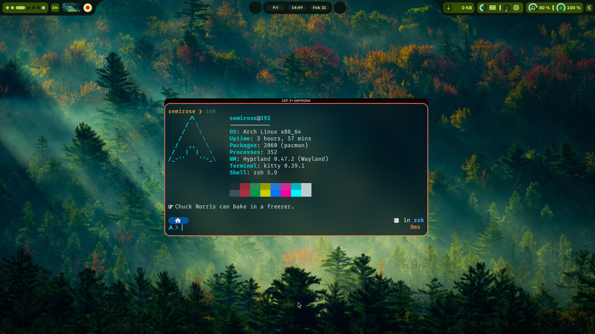
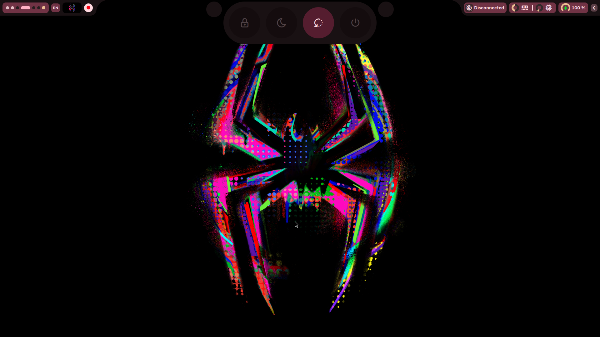

<div align=center>

# Fabric Shell\*

<sub> \*temporary name, recommendations are welcome </sub>

My new bar project, written in python with [fabric](https://github.com/Fabric-Development/fabric)

</div>

## Screenshots

<center>



|  |  |
| ------------------ | ------------------ |
|  |  |

</center>

## Installation

### Dependencies:

> [!NOTE]
> This project was only tested on Arch<sup>btw</sup>, but it should work on any distro that has all the dependencies.

- [fabric](https://github.com/Fabric-Development/fabric) <sub>obviously</sub>
- [fabric-cli](https://github.com/Fabric-Development/fabric-cli)
- Hyprland <sub>*Hyprland dependent widgets(only the workspace widget for now) could be systematically removed, allowing the use of any other **wayland** compositor.</sub>
- sass
- [wf-recorder](https://github.com/ammen99/wf-recorder)
- slurp
- [tabler-icons](https://github.com/tabler/tabler-icons) <sub>build for webfont to get ttf, or just use the AUR version on Arch</sub> 
- brightnessctl
- pamixer
- upower

`yay -S fabric-cli-git sass wf-recorder slurp ttf-tabler-icons brightnessctl pamixer upower` on arch should install all the dependencies(replace `yay` with your preffered AUR helper)

### Python dependencies:
- toml
- pillow
- platformdirs
- psutil

> [!NOTE]
> Using a python venv is recommended on Arch. this project uses [uv](https://github.com/astral-sh/uv) as a package manager.

### Installation:
```bash
git clone https://github.com/Sem1Rose/fabric-shell.git
cd fabric-shell
uv run main.py
```

## Performance
- ram usage is somwhere around 200MB.
- cpu usage is usually below 1%, spikes to ~8% with heavy animations, a lot more while caching wallpapers.
